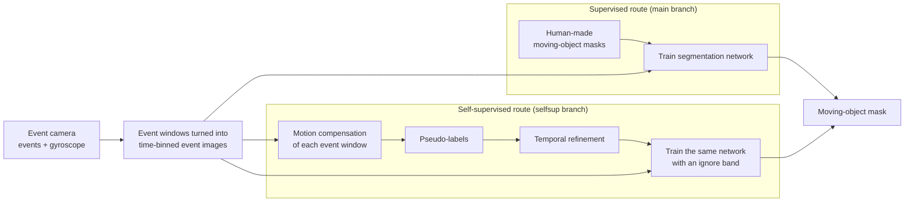
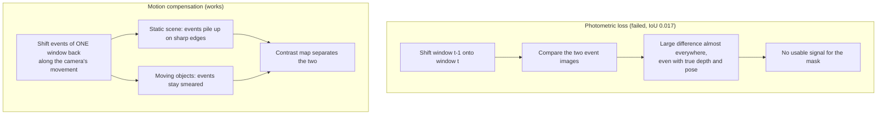
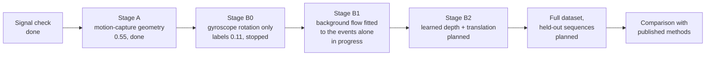
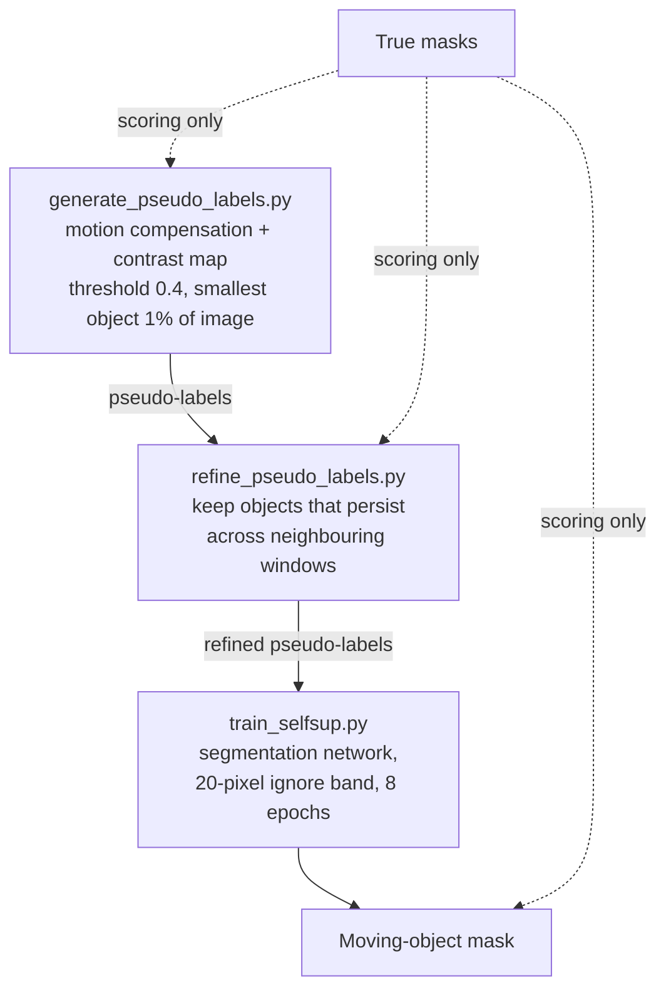

# Moving-Object Detection from Event Cameras

This project finds **independently moving objects** in the output of an
**event camera**, on the EVIMO2 dataset. It has two routes:

| Route | Trains on | Status | Branch |
|---|---|---|---|
| **Supervised** | Human-made object masks from the dataset | Working (about 0.97 on the training frames of one sequence) | `main` |
| **Self-supervised** | Labels the method makes itself from event motion; no human masks | In progress (stage A: 0.55 ± 0.02 on one sequence) | `selfsup` |

> All numbers below are measured on the **training frames of a single
> sequence**. They show that a method *can* learn the task. Results on
> **held-out sequences** (the numbers for publication) come from the
> full-dataset runs, which are still pending.

---

## Key terms

| Term | Meaning |
|---|---|
| **Event camera** | A camera whose pixels report brightness *changes* ("events") as they happen, instead of full images at a fixed rate. |
| **Event window** | All events between two consecutive dataset frames (one "frame" of events). |
| **Moving-object mask** | Per-pixel answer to "is this pixel on an object moving on its own (not just appearing to move because the camera moves)?" |
| **IoU** (intersection over union) | Overlap between predicted and true masks: correct moving pixels ÷ (correct + false alarms + missed). 1.0 is perfect. Static background does not count. |
| **Ego-motion** | The camera's own movement. It makes the *whole* scene appear to move. |
| **Motion compensation** | Shifting every event back along the camera's own movement. Static scene events then pile up on sharp edges; events from independently moving objects stay smeared. |
| **Pseudo-label** | A moving-object mask produced automatically by the method, used as a training target instead of a human-made mask. |
| **Ignore band** | A ring of pixels around each pseudo-labelled object that is left out of training, because pseudo-labels often cover only part of an object. |
| **Temporal refinement** | Keeping only pseudo-labelled objects that persist across neighbouring event windows; objects that flicker for one window are dropped. |
| **Motion capture** | The external camera system that recorded EVIMO2's true camera positions and depth. Not available on a real deployed camera. |
| **Inertial sensor (gyroscope)** | The rotation sensor built into each event camera. It *is* available on a real deployed camera. |

---

## Overview



Both routes use **the same network** (`src/models/supervised_model/`): an
event encoder with a U-shaped decoder that outputs a full-resolution
moving-object mask, optionally helped by the gyroscope. Only the
*training labels* differ.

---

## Results so far

### Supervised route (single sequence, training frames)

| Model | Script | IoU |
|---|---|---|
| Segmentation network, human masks | `train_supervised.py` | ≈ 0.97–0.99 |
| Version 3 model, human masks | `train_v3.py --gt-mask-sanity` | 0.97 |
| Upper bound: network given *true* depth and camera pose as input | `train_gt_mask.py` | 0.96 |

### Self-supervised route — right camera, sequence `scene14_dyn_test_01` (405 frames)

| Step | IoU |
|---|---|
| Previous self-supervised attempt (photometric loss) | 0.017 |
| Do nothing: every pixel with an event counted as moving | ≈ 0.15 |
| Pseudo-labels from motion compensation (motion-capture geometry) | 0.38 |
| + network trained on them with the ignore band | 0.51 |
| **+ temporal refinement of the pseudo-labels** | **0.55 ± 0.02** (three runs: 0.531, 0.553, 0.566) |

Left camera (`scene6_dyn_train_03`, camera almost still): pseudo-labels
0.34, network 0.37. Motion compensation has little to work with when the
camera barely moves.

Reported self-supervised numbers use the **last training epoch at a fixed
decision threshold of 0.5**, so no choice is made by looking at the true
masks. The true masks are only used to score results.

---

## Why the earlier self-supervised attempt failed

The first design predicted depth and camera movement, used them to shift
one event window onto the next, and trained with a **photometric loss**
(pixel-by-pixel difference between the two). That assumes a scene point
looks the same in both windows. Event cameras break that assumption:
an edge produces events only while its brightness changes, so the same
static edge looks different whenever the camera's movement changes.



Measured on the right-camera sequence (`selfsup_signal_check.py`):

| Camera movement used for compensation | IoU of the resulting signal |
|---|---|
| None | ≈ 0.15–0.18 |
| Rotation only | 0.25 |
| Rotation + translation + depth | 0.58 |

---

## Self-supervised roadmap



| Stage | Geometry used to make pseudo-labels | Fully self-supervised? |
|---|---|---|
| A | Motion-capture depth and camera pose | No: uses dataset measurements (but no human masks) |
| B0 | Rotation from the camera's own gyroscope; no depth, no translation | Yes |
| **B1** | A smooth background flow (8 numbers per window) fitted to each window's events by making them as sharp as possible; no other sensor | **Yes** |
| B2 | Depth and translation predicted by a network trained to make motion-compensated events as sharp as possible | Yes: the main contribution |

Expected ordering: B0 ≤ B1 ≤ A.

**B0 result (right camera, one sequence):** pseudo-label IoU 0.11 (0.113 after
refinement), against 0.38 for stage A. The camera rotates only about 0.13° per
window, roughly one pixel of image motion, so rotation compensation changes
almost nothing and the gyroscope-to-camera axes could not be identified (the
best and second-best of the 48 arrangements were tied, margin 1.001). Most
background motion in this sequence comes from camera translation, which a
gyroscope cannot measure. This motivated B1.

### Stage A / B pipeline in detail



---

## How to run

Set your paths first (examples are for Kaggle):

```bash
DATA=/kaggle/input/datasets/makkisakib1/evimo2/single_seq_root
WORK=/kaggle/working
```

Expected dataset layout: `$DATA/<camera>/<subset>/<split>/<sequence>/`, for
example `$DATA/right_camera/imo/train/scene14_dyn_test_01_000000/`. The
preprocessing caches (`event_index.npz`, `frame_motion.npz`,
`camera_motion.npz`, `imu_index.npz`) must already exist in each
sequence's `cache/` folder (`tools/preprocessing/preprocess.py`).

### Tests (run first; CPU is enough)

```bash
python tests/test_supervised_model.py     # network, loss, trainer
python tests/test_selfsup_signal.py       # motion-compensation geometry
python tests/test_pseudo_labels.py        # pseudo-labels, ignore band, refinement
python tests/test_imu_rotation.py         # stage B0: gyroscope rotation + axis calibration
python tests/test_event_flow.py           # stage B1: background flow fitted from events alone
```

### Supervised route

```bash
# one sequence, scored on its own frames
python train_supervised.py --dataset-root $DATA \
  --sensors right_camera --subsets imo --split train \
  --overfit --epochs 40 --save-dir $WORK/runs/supervised_single

# full dataset, scored on a held-out split (check its folder name: often "eval")
python train_supervised.py --dataset-root /path/to/full_evimo2 \
  --sensors left_camera right_camera samsung_mono --subsets imo imo_ll \
  --split train --val-split eval --epochs 60 --event-dropout 0.1 \
  --save-dir $WORK/runs/supervised_full
```

### Self-supervised route, stage A (motion-capture geometry)

```bash
python generate_pseudo_labels.py --dataset-root $DATA \
  --sensors right_camera --subset imo --split train \
  --threshold 0.4 --min-area 0.01 \
  --out-dir $WORK/pseudo_labels_right_v2

python refine_pseudo_labels.py --pseudo-label-dir $WORK/pseudo_labels_right_v2 \
  --out-dir $WORK/pseudo_labels_right_v4 --dataset-root $DATA \
  --sensors right_camera --subset imo --split train --window 1 --min-support 2

python train_selfsup.py --dataset-root $DATA \
  --sensors right_camera --subsets imo --split train \
  --pseudo-label-dir $WORK/pseudo_labels_right_v4 \
  --pseudo-ignore-band 20 --depth-weight 0 --pose-weight 0 \
  --overfit --epochs 8 --save-dir $WORK/runs/selfsup_stage_a
```

### Self-supervised route, stage B0 (gyroscope only)

Same three steps; only the first changes:

```bash
python generate_pseudo_labels.py --dataset-root $DATA \
  --sensors right_camera --subset imo --split train \
  --geometry imu_rotation --threshold 0.4 --min-area 0.01 \
  --out-dir $WORK/pseudo_labels_right_b0
```

The dataset does not provide the transform between the gyroscope's axes
and the camera's axes, so the script finds it **from the events alone**:
it tries all 48 possible axis arrangements and keeps the one that makes
rotation-compensated events sharpest. The chosen arrangement is printed
and saved in `pseudo_label_report.json`; it can be reused with
`--imu-axes`.

### Self-supervised route, stage B1 (events only)

Same three steps; only the first changes. Quick check on 40 windows first
(a few minutes), then the full sequence (roughly an hour on a CPU):

```bash
python generate_pseudo_labels.py --dataset-root $DATA \
  --sensors right_camera --subset imo --split train \
  --geometry events --flow-model planar --threshold 0.4 --min-area 0.01 \
  --limit-frames 40 --out-dir $WORK/pseudo_labels_right_b1_check
```

For each window, the background displacement is modelled by a short formula
(`--flow-model`: `translation` 2 numbers, `affine` 6, `planar` 8) whose numbers
are chosen to make the compensated events as sharp as possible. Depth and
motion-capture pose are loaded only to print a comparison line ("fitted vs
motion-capture background flow"); they never affect the labels.
`--geometry none` gives the no-compensation baseline with the same report.

### Reading the results

* `train_selfsup.py` / `train_supervised.py` end with a `FINAL` block.
  Report **LAST EPOCH → IoU at threshold 0.50**. The "best checkpoint"
  line is optimistic when the score is computed on training frames.
* Pseudo-label scripts end with a quality table against the true masks
  (for reporting only; the labels never see the true masks).
* TensorBoard: `tensorboard --logdir $WORK/runs`. Images show the event
  image, prediction, true mask, and an overlay (red = prediction,
  green = truth).

---

## Repository map (current)

| Path | Purpose |
|---|---|
| `src/data/` | EVIMO2 loading, event windows, time-binned event images, samplers |
| `src/data/pseudo_labels.py` | Saving and loading pseudo-labels |
| `src/data/temporal_refine.py` | Temporal refinement of pseudo-labels |
| `src/data/imu_rotation.py` | Gyroscope integration and label-free axis calibration (stage B0) |
| `src/data/event_flow.py` | Background flow fitted to the events alone by sharpness maximisation (stage B1) |
| `src/models/supervised_model/` | The segmentation network, its loss, and target construction |
| `src/utils/metrics.py` | IoU and related scores (speed-aware definition of "moving") |
| `selfsup_signal_check.py` | Measures how much moving-object signal motion compensation gives |
| `generate_pseudo_labels.py` | Makes pseudo-labels (stage A: `--geometry mocap`; B0: `imu_rotation`; B1: `events`; baseline: `none`) |
| `refine_pseudo_labels.py` | Temporal refinement of an existing pseudo-label folder |
| `train_selfsup.py` | Self-supervised training (always on pseudo-labels) |
| `train_supervised.py`, `trainer_supervised.py` | Supervised training; shared trainer |
| `train_v2.py`, `train_v3.py`, `train_gt_mask*.py` | Earlier models, kept for comparison |
| `tests/` | Self-tests for each component |
| `Evimo_dataset_summary.md`, `docs/` | Dataset notes and earlier design documents |

---

## Honest limitations

* Every number above is on the training frames of one sequence.
* Stage A uses motion-capture geometry to make its labels, so it is not
  yet fully self-supervised; stages B0, B1 and B2 remove that.
* The supervised result (≈0.97) is not a realistic target for the
  self-supervised route. The meaningful comparison is with published
  self-supervised methods on EVIMO2, on held-out sequences.

---

## Environment

```bash
conda env create -f environment.yml
conda activate EventProject
```

On Kaggle, the preinstalled PyTorch, NumPy, SciPy and OpenCV are enough.

## License

See `LICENSE`.
